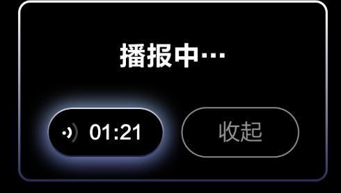
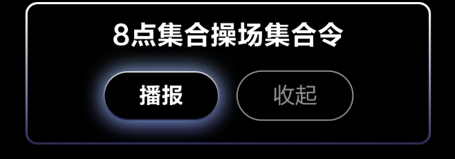
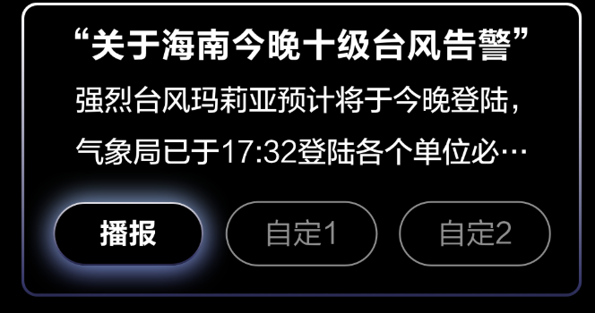
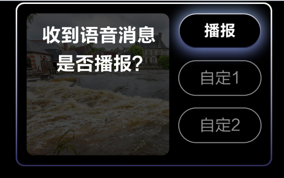
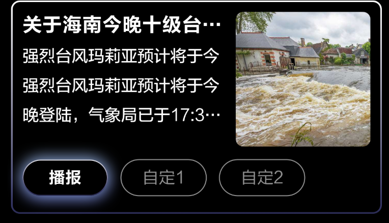

# Glass UI SDK
**Version: 1.2.0**  

## 一、UI SDK介绍
---
### 1.1 概述
提供一套在Rokid Glass上开发应用的基础UI库,目前已经提供以下支持：  

**1. GlassAlignment**   
由于AR 眼镜特有的屏幕显示特性，在开发眼镜上的识别类应用时，     
需要对marked UI做一次align，以保证人眼看到的marked UI和真实世界对齐。

**2. GlassButton**   
Glass自定义的Button    

**3. GlassDialog**   
提供了一系列常用的对话框

## 二、集成说明
---
在project的build.gradle中添加jcenter依赖：
``` gradle
allprojects {
    repositories {
        google()
        jcenter()
    }
}
```
### 2.1 Gradle依赖
``` gradle
implementation 'com.rokid.glass:ui:1.0.0'
```

### 2.2 Demo
[Glass UI Demo](https://github.com/rokid/glass-ui)

## 三、功能列表
---
### 3.1 RokidSystem
Alignment概念：
Camera预览界面通过Glass显示屏幕进入人眼睛的映射过程.

在手机上开发如下图：


在眼镜上开发如下图：


1. 蓝色代表`相机预览`的画面  
2. 绿色代表`相机预览`中物体的坐标   
3. 橙色代表`LCD屏幕`在`相机预览`的映射区域,百分比表示真实世界在虚拟世界的比例
4. 白色代表物体映射到`LCD屏幕`的显示区域

#### 3.1.1 getAlignmentRect
说明：根据preview的rect，获取到映射到LCD屏幕的区域
```java
public static Rect getAlignmentRect(final int previewWidth, final int previewHeight, final Rect previewRect)
```  
|参数|含义|默认值
|---|---|---|
|previewWidth|Camera preview宽||
|previewHeight|Camera preview高||
|previewRect|Camera preview的Rect||

示例代码：人脸识别后，在屏幕上画出人脸Rect   
``` java
public static final int PREVIEW_WIDTH = 1280;
public static final int PREVIEW_HEIGHT = 720;

//camera preview的人脸区域
Rect previewRect = faceDoCache.faceDo.toRect(getWidth(), getHeight());

//根据preview的人脸Rect，映射后，获取最终在屏幕上绘制的Rect
Rect rect = RokidSystem.getAlignmentRect(PREVIEW_WIDTH, PREVIEW_HEIGHT,previewRect);

...
//根据
canvas.save();
canvas.translate((rect.left + rect.right) / 2f, (rect.top + rect.bottom) / 2f);

drawRect(canvas, 0, rect.width(), rect.height(), paint, rectConfig);
drawRect2(canvas, 0, rect.width(), rect.height(), paint, rectConfig);
drawRect(canvas, 180, rect.width(), rect.height(), paint, rectConfig);
drawRect2(canvas, 180, rect.width(), rect.height(), paint, rectConfig);

canvas.restore();
...
```
#### 3.1.2 getWindowRect
说明：根据LCD屏幕的rect，获取到preview的区域rect
``` java
public static Rect getWindowRect(final int previewWidth, final int previewHeight, final Rect windowRect) {
```
|参数|含义|默认值
|---|---|---|
|previewWidth|Camera preview宽||
|previewHeight|Camera preview高||
|windowRect|屏幕上的Rect||

示例代码: 根据屏幕上的roi区域，得到preview 上的roi区域
```java
Rect window = new Rect(0,0,1280,720);
roiRect = RokidSystem.getWindowRect2K(CameraParams.PREVIEW_WIDTH,CameraParams.PREVIEW_HEIGHT, window);
roiRect = FaceRectUtils.scaleRect(roiRect, CameraParams.PREVIEW_WIDTH,CameraParams.PREVIEW_HEIGHT, FaceParams.roiScale);
...

VideoDFaceConf config = new VideoDFaceConf();
config.setDataType(DataFormat.DATA_YUV420);
config.setSize(CameraParams.PREVIEW_WIDTH, CameraParams.PREVIEW_HEIGHT);
config.setRoi(roiRect);

```

### 3.2 GlassButton
Glass自定义的Button

`Focused`:  


`Normal`


#### 3.2.1 用法
``` xml
<com.rokid.glass.ui.button.GlassButton
    android:id="@+id/confirm_btn"
    style="@style/GlassButton"
    android:layout_width="@dimen/glass_button_width"
    android:layout_height="@dimen/glass_button_height"
    android:text="@string/confirm_text" />
```
### 3.3 GlassDialog
提供了一系列常用的对话框,通过不同Builder 来构建不同类型的对话框。
目前提供的Builder:
#### 3.3.1 NotificationDialogBuilder
通知栏通知（出现固定时间后消失）


|方法|含义|默认值
|---|---|---|
|setTitle|设置通知栏标题|null|
|setMessage|设置通知栏内容|null|
|setIconRes|设置通知icon||
|setDuration|设置通知栏消息时间(ms)|3000|

**示例代码**
``` java
GlassDialog notificationDialog = new GlassDialog.NotificationDialogBuilder(this)
            .setTitle(getString(R.string.notification_title))
            .setMessage(getString(R.string.notification_message))
            .setIconRes(R.mipmap.ic_launcher)
            .setDuration(3000)
            .create();
notificationDialog.show();
```


#### 3.3.2 SimpleVoiceDialogBuilder
纯语音通知



|方法|含义|默认值
|---|---|---|
|setTitle|设置标题|null|
|setConfirmText|设置确定按钮文字|确定|
|setCancelText|设置取消按钮文字|取消|
|setConfirmListener|设置Confirm监听||
|setCancelListener|设置Cancel监听||
|dynamicTitle|动态改变标题||
|dynamicConfirmText|动态改变确定按钮文字| |
|dynamicCustomConfirmView|自定义Confirm界面布局| - |

**示例代码**
``` java
GlassDialog simpleVoiceDialogBuilder = new GlassDialog.SimpleVoiceDialogBuilder(this)
            .setTitle(getString(R.string.voice_test))
            .setConfirmText(getString(R.string.voice_play))
            .setCancelText(getString(R.string.voice_collapse))
            .setConfirmListener(new GlassDialogListener() {
                @Override
                public void onClick(View view) {
                    Toast.makeText(MainActivity.this,
                            "Click Confirm", Toast.LENGTH_SHORT).show();

                    mSimpleVoiceDialogBuilder.dynamicTitle(getString(R.string.voice_playing));
                    mSimpleVoiceDialogBuilder.dynamicCustomConfirmView(mCustomTimerView);

                    countDownManager.start();
                }
            })
            .setCancelListener(new GlassDialogListener() {
                @Override
                public void onClick(View view) {
                    Toast.makeText(MainActivity.this,
                            "Click Cancel", Toast.LENGTH_SHORT).show();

                    if (null != countDownManager) {
                        countDownManager.cancel();
                    }
                }
            });

simpleVoiceDialogBuilder.show();
```


#### 3.3.3 ImageDialogBuilder
语音图片通知


|方法|含义|默认值
|---|---|---|
|setTitle|设置标题|null|
|setConfirmText|设置确定按钮文字|确定|
|setCancelText|设置取消按钮文字|取消|
|setNotifyResId|设置图片显示,res方式||
|setNotifyBitmap|设置图片显示,bitmap方式||
|setConfirmListener|设置Confirm监听||
|setCancelListener|设置Cancel监听||
|dynamicConfirmText|动态改变确定按钮文字||
|dynamicCustomConfirmView|自定义Confirm界面布局|-|

**示例代码**
``` java
mImageDialogBuilder = new GlassDialog.ImageDialogBuilder(this)
            .setTitle(getString(R.string.image_title))
            .setConfirmText(getString(R.string.voice_play))
            .setCancelText(getString(R.string.voice_collapse))
            .setNotifyResId(R.mipmap.ic_notify_img)
            .setConfirmListener(new GlassDialogListener() {
                @Override
                public void onClick(View view) {
                    Toast.makeText(MainActivity.this,
                            "Click Confirm", Toast.LENGTH_SHORT).show();

                    mImageDialogBuilder.dynamicCustomConfirmView(mCustomTimerView);
                    countDownManager.start();
                }
            })
            .setCancelListener(new GlassDialogListener() {
                @Override
                public void onClick(View view) {
                    Toast.makeText(MainActivity.this,
                            "Click Cancel", Toast.LENGTH_SHORT).show();

                    if (null != countDownManager) {
                        countDownManager.cancel();
                    }
                }
            });

mImageDialogBuilder.show();
```


#### 3.3.4 SimpleMessageDialogBuilder
仅有标题  



|方法|含义|默认值
|---|---|---|
|setTitle|设置标题|null|
|setConfirmText|设置确定按钮文字|确定|
|setCancelText|设置取消按钮文字|取消|
|setConfirmListener|设置Confirm监听||
|setCancelListener|设置Cancel监听|-|

**示例代码**
``` java
new GlassDialog.SimpleMessageDialogBuilder(this)
            .setTitle(getString(R.string.simple_message_title))
            .setConfirmText(getString(R.string.voice_play))
            .setCancelText(getString(R.string.voice_collapse))
            .setConfirmListener(new GlassDialogListener() {
                @Override
                public void onClick(View view) {
                    Toast.makeText(MainActivity.this,
                            "Click Confirm", Toast.LENGTH_SHORT).show();
                }
            })
            .setCancelListener(new GlassDialogListener() {
                @Override
                public void onClick(View view) {
                    Toast.makeText(MainActivity.this,
                            "Click Cancel", Toast.LENGTH_SHORT).show();

                }
            }).show();
```

#### 3.3.5 SimpleContentDialogBuilder
标题+正文


|方法|含义|默认值
|---|---|---|
|setTitle|设置标题|null|
|setContent|设置内容|null|
|setConfirmText|设置确定按钮文字|确定|
|setCancelText|设置取消按钮文字|取消|
|setConfirmListener|设置Confirm监听| |
|setCancelListener|设置Cancel监听|-|

**示例代码**
```java
new GlassDialog.SimpleContentDialogBuilder(this)
            .setTitle(getString(R.string.simple_message_title))
            .setConfirmText(getString(R.string.voice_play))
            .setCancelText(getString(R.string.voice_collapse))
            .setContent(getString(R.string.simple_content))
            .setConfirmListener(new GlassDialogListener() {
                @Override
                public void onClick(View view) {
                    Toast.makeText(MainActivity.this,
                            "Click Confirm", Toast.LENGTH_SHORT).show();
                }
            })
            .setCancelListener(new GlassDialogListener() {
                @Override
                public void onClick(View view) {
                    Toast.makeText(MainActivity.this,
                            "Click Cancel", Toast.LENGTH_SHORT).show();

                }
            }).show();
```


#### 3.3.6 ImageContentDialogBuilder
标题+图片


|方法|含义|默认值
|---|---|---|
|setTitle|设置标题|null|
|setContent|设置内容|null|
|setNotifyResId|设置图片显示,res方式||
|setNotifyBitmap|设置图片显示,bitmap方式||
|setConfirmText|设置确定按钮文字|确定|
|setCancelText|设置取消按钮文字|取消|
|setConfirmListener|设置Confirm监听| |
|setCancelListener|设置Cancel监听|-|

**示例代码**
```java
new GlassDialog.ImageContentDialogBuilder(this)
            .setTitle(getString(R.string.image_content_title))
            .setConfirmText(getString(R.string.voice_play))
            .setCancelText(getString(R.string.voice_collapse))
            .setNotifyResId(R.mipmap.ic_notify_img)
            .setContent(getString(R.string.simple_content))
            .setConfirmListener(new GlassDialogListener() {
                @Override
                public void onClick(View view) {
                    Toast.makeText(MainActivity.this,
                            "Click Confirm", Toast.LENGTH_SHORT).show();
                }
            })
            .setCancelListener(new GlassDialogListener() {
                @Override
                public void onClick(View view) {
                    Toast.makeText(MainActivity.this,
                            "Click Cancel", Toast.LENGTH_SHORT).show();

                }
            }).show();
```

#### 3.3.7 CustomSimpleMsgDialogBuilder
自定义标题内容



|方法|含义|默认值
|---|---|---|
|setTitle|设置标题|null|
|setContent|设置内容|null|
|setCustomText|自定义按钮文本||
|setConfirmText|设置确定按钮文字|确定|
|setCancelText|设置取消按钮文字|取消|
|setConfirmListener|设置Confirm监听| |
|setCancelListener|设置Cancel监听| |
|setCustomListener|自定义按钮监听|-|

**示例代码**
```java
mCustomMessageDialog = new GlassDialog.CustomSimpleMsgDialogBuilder(this)
            .setTitle(getString(R.string.image_content_title))
            .setConfirmText(getString(R.string.voice_play))
            .setCancelText(getString(R.string.voice_collapse))
            .setCustomText(getString(R.string.voice_custom))
            .setContent(getString(R.string.simple_content))
            .setCustomListener(new GlassDialogListener() {
                @Override
                public void onClick(View view) {
                    Toast.makeText(MainActivity.this,
                            "Click Custom", Toast.LENGTH_SHORT).show();
                }
            })
            .setConfirmListener(new GlassDialogListener() {
                @Override
                public void onClick(View view) {
                    Toast.makeText(MainActivity.this,
                            "Click Confirm", Toast.LENGTH_SHORT).show();
                    if (null != mCustomMessageDialog && mCustomMessageDialog.isShowing()) {
                        mCustomMessageDialog.dismiss();
                    }
                }
            })
            .setCancelListener(new GlassDialogListener() {
                @Override
                public void onClick(View view) {
                    Toast.makeText(MainActivity.this,
                            "Click Cancel", Toast.LENGTH_SHORT).show();

                }
            })
            .show();
```

#### 3.3.8 CustomImageDialogBuilder
自定义图片样式1



|方法|含义|默认值
|---|---|---|
|setTitle|设置标题|null|
|setCustomText|自定义按钮文本||
|setConfirmText|设置确定按钮文字|确定|
|setCancelText|设置取消按钮文字|取消|
|setNotifyResId|设置图片显示,res方式| |
|setNotifyBitmap|设置图片显示,bitmap方式| |
|setConfirmListener|设置Confirm监听| |
|setCancelListener|设置Cancel监听| |
|setCustomListener|自定义按钮监听|-|

**示例代码**
```java
mCustomImageDialogBuilder = new GlassDialog.CustomImageDialogBuilder(this)
            .setTitle(getString(R.string.image_title))
            .setConfirmText(getString(R.string.voice_play))
            .setCancelText(getString(R.string.voice_collapse))
            .setCustomText(getString(R.string.voice_custom))
            .setNotifyResId(R.mipmap.ic_notify_img)
            .setCustomListener(new GlassDialogListener() {
                @Override
                public void onClick(View view) {
                    Toast.makeText(MainActivity.this,
                            "Click Custom", Toast.LENGTH_SHORT).show();
                }
            })
            .setConfirmListener(new GlassDialogListener() {
                @Override
                public void onClick(View view) {
                    Toast.makeText(MainActivity.this,
                            "Click Play", Toast.LENGTH_SHORT).show();
                    mCustomImageDialogBuilder.dynamicCustomConfirmView(mCustomTimerView);
                    countDownManager.start();
                }
            })
            .setCancelListener(new GlassDialogListener() {
                @Override
                public void onClick(View view) {
                    Toast.makeText(MainActivity.this,
                            "Click Cancel", Toast.LENGTH_SHORT).show();

                }
            });

mCustomImageDialogBuilder.show();
```

#### 3.3.9 CustomImageContentDialogBuilder
自定义图片样式2



|方法|含义|默认值
|---|---|---|
|setTitle|设置标题|null|
|setContent|设置内容|null|
|setCustomText|自定义按钮文本||
|setConfirmText|设置确定按钮文字|确定|
|setCancelText|设置取消按钮文字|取消|
|setNotifyResId|设置图片显示,res方式| |
|setNotifyBitmap|设置图片显示,bitmap方式| |
|setConfirmListener|设置Confirm监听| |
|setCancelListener|设置Cancel监听| |
|setCustomListener|自定义按钮监听|-|

**示例代码**
```java
new GlassDialog.CustomImageContentDialogBuilder(this)
            .setTitle(getString(R.string.image_content_title))
            .setConfirmText(getString(R.string.voice_play))
            .setCancelText(getString(R.string.voice_collapse))
            .setNotifyResId(R.mipmap.ic_notify_img)
            .setContent(getString(R.string.multi_content))
            .setCustomText(getString(R.string.voice_custom))
            .setCustomListener(new GlassDialogListener() {
                @Override
                public void onClick(View view) {
                    Toast.makeText(MainActivity.this,
                            "Click Custom", Toast.LENGTH_SHORT).show();
                }
            })
            .setConfirmListener(new GlassDialogListener() {
                @Override
                public void onClick(View view) {
                    Toast.makeText(MainActivity.this,
                            "Click Play", Toast.LENGTH_SHORT).show();
                }
            })
            .setCancelListener(new GlassDialogListener() {
                @Override
                public void onClick(View view) {
                    Toast.makeText(MainActivity.this,
                            "Click Cancel", Toast.LENGTH_SHORT).show();

                }
            })
            .show();
```
